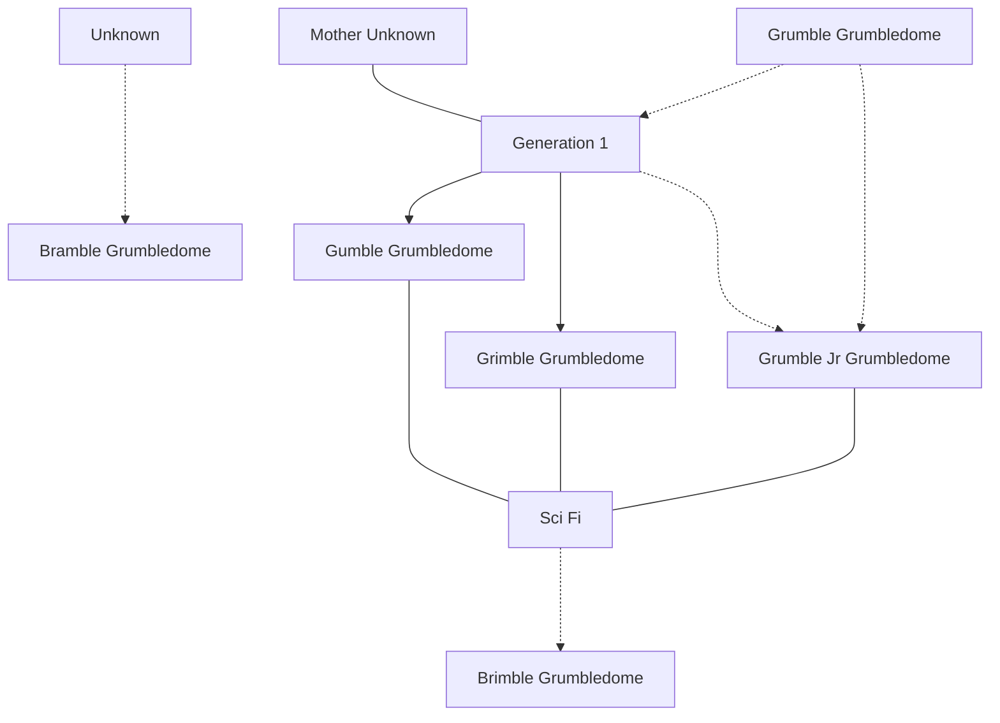

# Summary

Dear Future (level 3) Magicians and Scholars,

Join us at Strixxhaven's New Student Orientation, where the magic of knowledge awaits! Discover the secrets of our enchanted campus and embark on a journey of academic wonders. We will meet in the campus community center, the Grimbledome, for an interactive historical exhibit to begin your integration into campus life. Let the adventure begin on 1/10/2024 at 7:30. Be prepared to unlock the doors to a realm of limitless possibilities!

Click the link below to register for orientation today!
https://app.roll20.net/join/16510305/Q_IF-g

Best,
The Strixxhaven Welcome Committee


Jason
6th yr freshman drug money

# Game Running notes-

## Entering the college community center, the #Grimbledome, welcoming speech
- 50 years past campaign
- the party arrives on campus through portals in Baldur's Gate
- Welcome speech by Strixxhaven Welcome Committee
	- leera silverhand?
	- lereals daughter

- Party perception check
	- highest role finds briefs of telekinesis?
	- DC 20 sees the tag has a name written on it, Grumble Jr.
## Encounter- Broken Strixxhaven display hurts a Lorehold TA 
- #Milos, the thief in baldurs gate turned printer is the professor in the college of Lorehold
- when the TA is hurt, #Milos says:
```
"OH SHIT NO NO NOT AGAIN, THIS CANNOT HAPPEN AGAIN, THE GRUMBLEDEAN IS GONNA KILL ME PLEASE HELP HELP HELP-
ITS ONLY MY FIRST DAYYY, HE JUST LET ME START AGAIN AFTER LAST TIME"
```
- #Milos requires your help in getting 2 items ASAP!!
	- get #Black_label_50_yr_aged_Fredricks_Quilk_Milk
	- find #Darnoas_Pactflower , frail thing of beauty
		- you'll have to visit the #sporest
## Skill Challenge- win the rare #Black_label_50_yr_aged_Fredricks_Quilk_Milk
- Inside what appears to be a church refitted as a pub called, #Hudelos_Remains, the remarkably old bartender named #Chad former addicted turned Tyr cultist turned barkeep
	- Give the Goliath #BOOF the best cocktail
	- Selling #Uruk_Mystery_Meat 
		- **anyone eating it gets the benefits of heroes feast**
	- There are some grumble scouts at the bar some kids are scared of
	 - There is a child gnome that is pissed off at you
		- "THATS ME UNDIES!!!"
			- my name is on it!!
		- claims he's a janitor
			- casts disintegrate on a squirrel?
## 1/24 game
what did the party do with grumble jr?


#### Set the stage- 
context you on the patio of  a lively, colorful tavern
- perception
	- you notice there's a sign for selling uruk's mystery meat


## Encounter- recover #Darnoas_Pactflower

- Enter the #sporest , the woods of the college of [ ] ??
	- Shrooms everywhere, you think this college might be on a ***giant mushroom island***??
		- the one our party created
- Two powerful BEASTS fighting (non lethally?) over an item, you need to take it

	- They tug on opposite ends of a GIANT, FLAMING flower, #Darnoas_Pactflower its 10 ft tall, the stem is like 10 inch diameter
		- remarkably light
	- In a turn or two, the flower will snap in half, and EXPLODE doing fire damage, scorching ray?
		- when it explodes
	- At the end of the combat, a young half orc scolds the beasts for being rude, thanks you for stopping them
		- "My dad is gonna kill me!!!"


# Grumble Jr ending
==CAN I GET A **PETRIFIED GRUMBLEDOME** CHARACTER TO SETUP CHRIS' ONE SHOT CHARACTER==

- Grumble Jr jumps into the fray in final combat to get his undies back in the heat of the moment
	- no spells bc he didn't pace himself
	- **he has 10 hp.**
		- because he's baby

- Gumbalina Grumbledome or Grumble Sr ? saves Jr in final combat
	- Jr's last words are, ***"I'm so fucking baby"***


![[Pasted image 20240207180436.png]]
![[Pasted image 20240207180620.png]]
2 flaming owlbears, named bert and ernie

- owlbear 1 - 12


uduk
